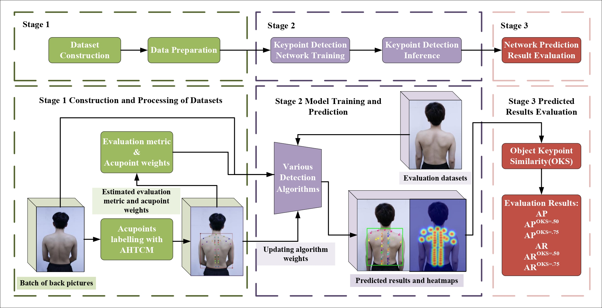
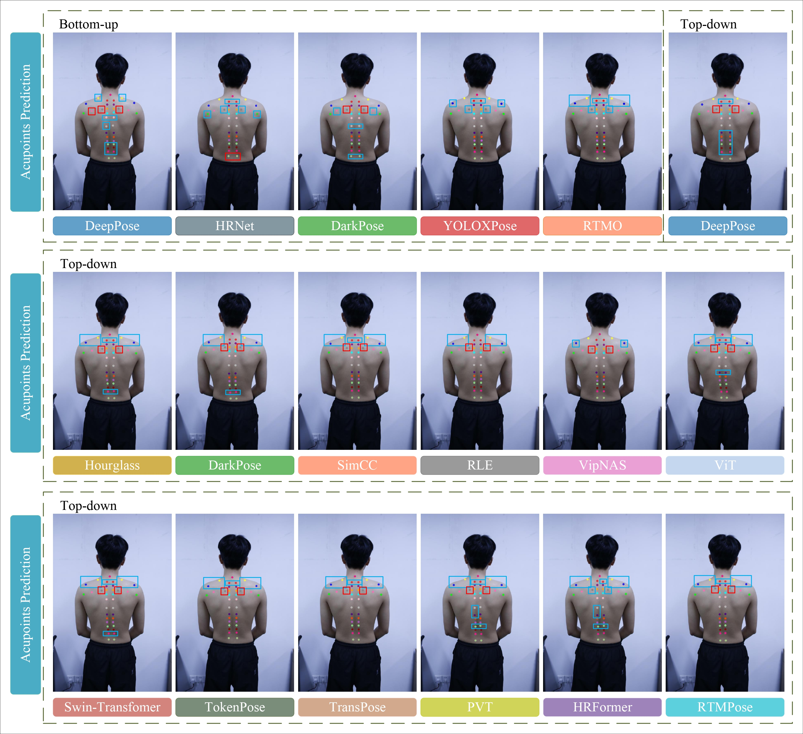

# DMDBAK
This repo is the official implementation for <mark>Benchmark for Human Back Acupuncture Point Detection:Comprehensive Algorithmic Evaluation</mark>.

# Benchmark for Human Back Acupuncture Point Detection
A publicly available dataset specialized for the detection of keypoints on human back acupoints has been pioneered and constructed by this paper: DMD-BAK(*Data science,Machine learning & Dynamical control:Back Acupoints Keypoints*).

The performance of deep learning keypoint detection networks with different paradigms, architectures, and features on the back acupoint dataset was comprehensively analyzed by this paper.

# Overall architecture for human back acupuncture point dataset construction and evaluation of various algorithms


# Comparison of prediction results


# Data Preparation
### Please download our public dataset first
Our dataset website is available at https://www.kaggle.com/datasets/chunzheye/dmd-bak.
### Data Processing
Process the downloaded dataset into coco or yolo format, our code handles coco format.
- Put downloaded data into the following directory structure:
  ```
    - backacupoint_data/
      - images/
        -all_images
      - labelme_jsons/
        -all_jsons
- Split dataset:
  ```
  python tools/dataset/split_dataset.py
- Conversion of labeling format to COCO format:
  ```
  python tools/dataset/val_labelme2coco.py
  ```
  ```
  python tools/dataset/test_labelme2coco.py
  ```

# Model Implementation & Environment Setup
Our model building, training and evaluation are implemented under the MMPose toolbox.
For the construction code of the relevant model, please refer to https://github.com/Ye-ChunZhe/mmpose.

Please refer to the official documentation for setting up the MMPose toolbox environment.https://github.com/open-mmlab/mmpose

# Training & Testing
### Training:
- Example: Back detection model training
  ```
  python tools/train.py ../../config/back_detection/rtmdet_mm_back.py
- Example: Acupoint keypoint detection model training
  ```
  python tools/train.py ../../config/acupoint_detection/vitpose-s_256×192.py
### Testing:

